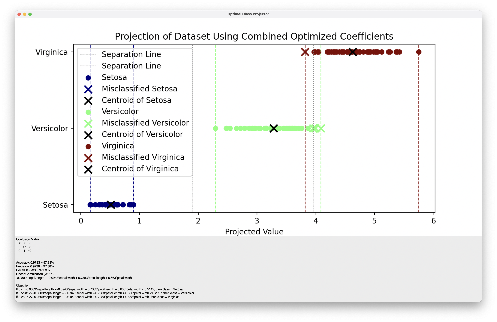

# OptimalClassProjector

Demo of optimizing coefficients for class separation using a combined objective function of inter-class distance and intra-class variance.

Iris 1-D resultant projection:

Iris 3-D Parallel Corodinates visualization:

## Mathematical Process

- Problem Definition

Given a dataset X with n samples and d features, and a corresponding label vector y indicating the class membership of each sample, the goal is to find a set of coefficients W that optimally separates the classes when projecting the data onto a 1-dimensional subspace.

- Projection of Data

Each sample x_i in the dataset X is projected onto a 1D space using the coefficients W:

XW = X · W

Where XW is the projected data.

- Class Centroids

For each class c in y, the centroid (mean) of the projected data is computed:

μ_c = mean(XW[y = c])

Where μ_c represents the centroid of class c in the projected space.

- Inter-Class Distance

The inter-class distance is defined as the minimum distance between the centroids of any two classes:

Inter-class Distance = min(|μ_i - μ_j| for i ≠ j)

This term ensures that the centroids of different classes are as far apart as possible in the projected space.

- Intra-Class Variance

The intra-class variance measures the spread of the samples within each class around their respective centroid:

Intra-class Variance = sum((XW_i - μ_c)^2 for x_i in class c)

This term ensures that the data points within each class are tightly clustered around their centroid.

- Combined Objective Function

The combined objective function balances the inter-class distance and intra-class variance:

Objective = -α \* Inter-class Distance + β \* Intra-class Variance

Where α and β are weights that control the importance of maximizing the inter-class distance and minimizing the intra-class variance, respectively.
7. Optimization

The goal is to find the optimal coefficients W that minimize the combined objective function. This is done using numerical optimization methods:

W\* = argmin_W (-α \* Inter-class Distance + β \* Intra-class Variance)

Where W\* represents the optimal coefficients for separating the classes.

- Projection and Visualization

Once the optimal coefficients W\* are found, the data is projected onto the 1D space defined by W\*, and the separation of the classes is visualized in the projected space.

## License

This project is freely available for personal and commerical use under the MIT license, see `LICENSE` for full details.
